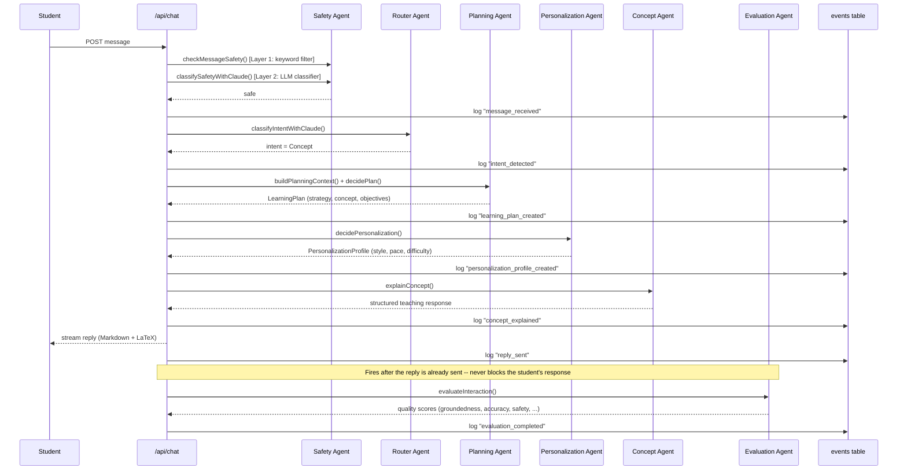

# A concept-teaching turn

The most common path: a student asks something that isn't a practice or assessment request. Traced from `web/src/app/api/chat/route.ts`.

Every arrow into `events` shares one `trace_id` — that's what the AI Transparency Panel (diagram 03) reconstructs later.
