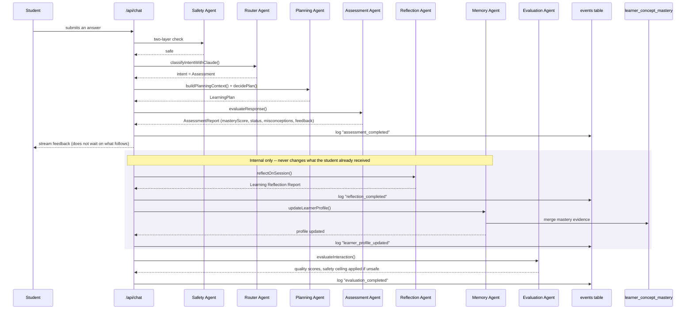

# An assessment turn — the deepest path

The only path that also runs Reflection and Memory — both are gated specifically on a *successful* Assessment result (their documented trigger event), not on every turn.

`learner_concept_mastery` written here is what powers Progress, the Learning Roadmap, Class/Student Overview, Progress Analytics, and Misconception Reports — one write path, read by five different screens across three roles.
