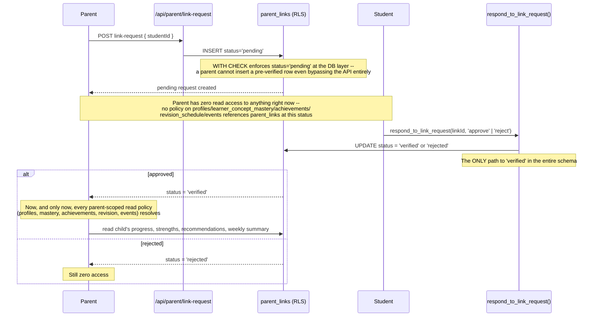

# Parent-child linking — zero access until explicitly verified

The core guarantee: a `pending` row grants a parent nothing. No read policy anywhere in the schema references `parent_links` unless `status = 'verified'` — and there is deliberately no way to reach `'verified'` except through the student's own approval.

Every parent-facing read this product has (Parent Dashboard, Child Detail, Weekly Summary) is scoped through this single `status = 'verified'` gate — there's no second, looser path into the same data.
