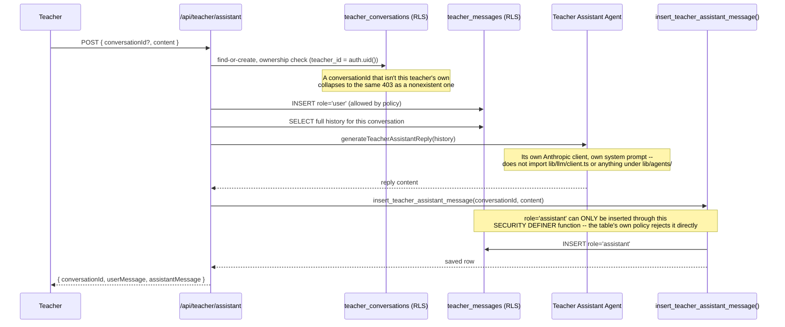

# AI Lesson Assistant — structurally separate from student chat

Same UI shape as student `/chat` (`MessageBubble`/`MessageInput` reused directly), a completely different data path underneath. See [ADR-005](../adr/005-teacher-assistant-separate-domain.md).

No arrow in this diagram ever touches `conversations` or `messages` (the student tables) — not because a policy forbids it, but because no code path here references them at all.
