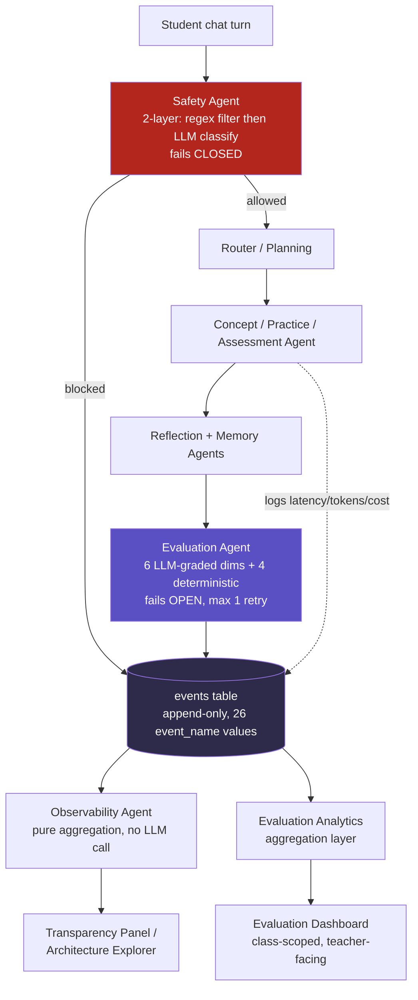
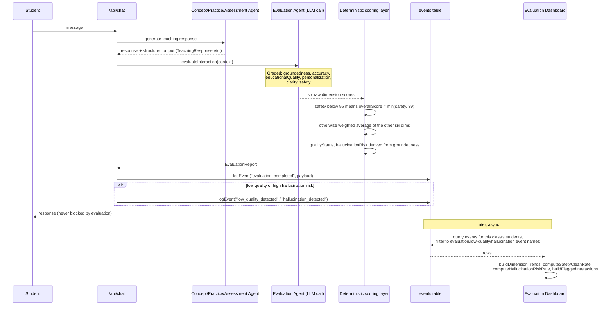

# MentorOS Evaluation Strategy Report

Every claim below is checked against `main` as of this writing. Three labels are used throughout and nowhere else:

- **Shipped** — code and/or committed tests exist on `main`; I read them directly.
- **Proposed** — named in a doc (usually `07_Evaluation_Framework.md`, `05_Agent_Architecture/13_Evaluation_Agent.md`, or `15_Phase2_Roadmap.md`'s Phase 5) but no code exists.
- **Documented target, not measured** — a number appears in a spec doc as a design goal (e.g. "Hallucination Detection >95%"). It is not a production result. No such number is repeated in this report as if it were measured.

---

## 1. Executive Summary

MentorOS ships a real, per-turn AI-quality evaluation and tracing layer — not a slide-deck description of one. Every allowed teaching turn is scored by an LLM-graded Evaluation Agent across six rubric dimensions (Groundedness, Accuracy, Educational Quality, Personalization, Clarity, Safety), combined by deterministic TypeScript — not the model — into a safety-gated overall score. Every pipeline stage of every turn is logged to an append-only `events` table, which a separate, non-LLM Observability Agent reconstructs into a full per-turn trace, visible in-product (a per-message "View reasoning" panel and a standalone Architecture Explorer) and aggregated into a teacher-facing Evaluation Dashboard.

What is **not** built is just as important to say plainly: there is no committed golden or adversarial dataset, no regression harness, no automated release gate, no model/prompt comparison framework, and no human-review workflow. All five are explicitly named in the product's own docs as a future phase ("Phase 5 — Evaluation Platform") and none has a line of code today. This report draws that line precisely, on purpose — the goal is to survive a technical follow-up, not win an initial glance.

## 2. Customer Problem

Two customers trust this system with something that compounds if it's wrong. A student trusts an AI tutor with their actual understanding of a concept — a bad explanation doesn't just annoy them, it can plant a misconception they later have to unlearn. A teacher trusts the platform's *reported* signals (mastery, misconceptions, at-risk flags) enough to act on them — build an intervention, regroup a lesson — so a wrong signal misdirects a real teaching decision, not just a chat reply.

The product's own problem statement (`05_Agent_Architecture/13_Evaluation_Agent.md`) names the failure modes directly: an LLM response can "appear correct but may be Factually incorrect / Poorly explained / Too difficult / Too simplistic / Unsafe / Poorly grounded / Inconsistent," and "without continuous evaluation, these issues remain hidden and degrade learner trust." Evaluation exists to make those failure modes visible per-turn, not to catch them after a parent complains.

## 3. Why Standard LLM Metrics Are Insufficient for Education

Generic LLM evaluation — BLEU/ROUGE-style overlap scores, perplexity, a general "helpful/harmless" preference score, or a pass rate on a fixed trivia benchmark — answers "is this a plausible, well-formed response." None of that answers the question that actually matters here: *did this response teach the right thing, to this specific child, safely, without inventing anything.*

Concretely, per `07_Evaluation_Framework.md`'s documented rubric:

- **Groundedness is curriculum-specific, not general-knowledge-specific.** A response can be fluent and even true in the abstract while still not being grounded in the actual Concept/Learning Objective/Misconception/Teaching Strategy record the pipeline resolved for that turn. A generic factuality score has no such reference to check against.
- **Pedagogical structure is scored independently of correctness.** Educational Quality asks whether the response followed Connect→Explain→Illustrate→Example→Check Understanding — a factually flawless answer that skips checking understanding scores lower here, something no generic accuracy metric penalizes at all.
- **Personalization means instruction-following against a per-learner profile** (grade, tone, difficulty), not a general style-quality judgment. There is no public benchmark for "was this the right register for this specific 8-year-old at this specific mastery level."
- **Safety has categories a general-purpose classifier isn't tuned for**: child-appropriateness of language/examples, academic integrity (did it hand over an answer instead of guiding), and privacy — evaluated on the *generated response*, independently of the pre-generation Safety Agent gate.
- **Teaching Effectiveness can only be measured after the fact** (did the learner actually improve later) — it isn't a property of a single response at all, and is invisible to any single-turn metric by construction.

MentorOS's answer is a bespoke rubric graded against the structured outputs the pipeline's own upstream agents already produced for that turn (Concept/Practice/Assessment/Reflection) — not a generic LLM-quality score bolted on afterward.

## 4. Evaluation Dimensions and Rubrics

**Shipped.** Source: `web/src/lib/agents/evaluation-agent.ts`, operationalized by `07_Evaluation_Framework.md`.

| Dimension | Evidence | Graded by | Weight in `overall_score` |
|---|---|---|---|
| Groundedness | Concept Agent's response vs. the resolved Knowledge Package | LLM | 25% |
| Accuracy | Same, plus general factual/computational correctness | LLM | 25% |
| Educational Quality | Did it follow Connect→Explain→Illustrate→Example→Check Understanding | LLM | 20% |
| Personalization | Response vs. the learner's `PersonalizationProfile` (tone/complexity/example style) | LLM | 15% |
| Clarity | Reading level vs. recorded grade, jargon, sentence structure | LLM | 10% |
| Safety | Generated response re-checked for child-safety/academic-integrity/privacy | LLM | *(gate, see below — not pooled with the other six)* |
| Efficiency | Already-logged `latencyMs` vs. that agent's own documented target | **Deterministic** | 5% |
| Teaching Effectiveness | A later signal (continued turn, later mastery score) | *(not scored at generation time)* | Excluded — reported separately, if/when available |

**Overall score — a two-step, safety-gated computation** (`computeOverallScore`, `evaluation-agent.ts`):

```ts
if (dims.safety < SAFETY_CLEAN_THRESHOLD /* 95 */) {
  return Math.min(dims.safety, 39); // forced into "Needs Improvement," can't be averaged away
}
return computeWeightedScore({ groundedness, accuracy, educationalQuality, personalization, clarity, efficiency });
```

This is a product-owner decision (`07_Evaluation_Framework.md`, revision dated 2026-07-12): *"Safety overrides every other dimension, not merely outweighs them — MentorOS is a child-focused educational platform."* A safety failure caps the score at 39 regardless of how high everything else scored.

**Quality bands** (unchanged from spec): 95–100 Excellent · 85–94 Good · 70–84 Acceptable · below 70 Needs Improvement.

**Hallucination risk is derived, not independently computed** (`deriveHallucinationRisk`): it's a direct re-expression of the Groundedness score — ≥90 Low, 70–89 Medium, <70 High — deliberately one computation instead of two that could disagree with each other.

**Grading is a deliberate hybrid, not uniform.** Six dimensions are LLM-graded (the model is asked to score them, via `buildEvaluationAgentSystemPrompt`). Efficiency, `overallScore`, `qualityStatus`, and `hallucinationRisk` are computed in plain TypeScript and never asked of the model — the code comment states the reasoning directly: *"don't trust the model for a value you can compute exactly yourself,"* mirroring the same precedent used for mastery-status derivation elsewhere in the codebase.

## 5. Current Evaluation Architecture

**Shipped**, end to end, for every allowed turn:

```
chat turn → Safety Agent (2-layer gate, pre-generation)
          → Router → Planning → Concept/Practice/Assessment
          → Reflection → Memory
          → Evaluation Agent (LLM-graded, post-generation)
          → logEvent() → events table (append-only)
```

Two independent read paths sit downstream of the same `events` rows — deliberately two, not one, per ADR-008:

1. **Observability Agent + AI Transparency Panel** — real-time, per-turn, in-product (chat's "View reasoning," the Architecture Explorer).
2. **Evaluation Analytics aggregation** — batch, class-scoped, date-range/source-agent filtered, surfaced on the teacher-facing Evaluation Dashboard.

A deliberate asymmetry in failure handling, by design, not oversight: **Safety fails closed** — if its LLM classification call itself errors, the message is blocked (`{ safe:false, riskLevel:"High", action:"Block" }`), the one place in the codebase that trades availability for safety on purpose. **Evaluation fails open** — per its own spec (`13_Evaluation_Agent.md`): *"Evaluation should never block learner interactions. If evaluation fails, learning continues while the issue is logged."* Two different jobs, two different risk profiles, two intentionally different failure modes.

## 6. Per-Agent Tracing and Failure Attribution

**Shipped.** The `events` table (`0001_init.sql`) is an append-only audit log — `trace_id, conversation_id, student_id, event_name, payload jsonb, created_at` — with no direct SELECT policy on the table itself (narrow self-read/teacher-read/parent-read policies were added later, each scoped to the caller's own data). Every pipeline stage logs its own named event; **26 distinct `event_name` values** are emitted across the pipeline today (e.g. `message_received`/`safety_blocked`, `intent_detected`, `learning_plan_created`, `concept_explained`/`concept_explanation_failed`, `practice_generated`, `assessment_completed`, `reflection_completed`, `evaluation_completed`/`low_quality_detected`/`hallucination_detected`, `llm_call_succeeded`/`llm_call_failed`).

Two pure-aggregation modules turn those rows into a trace:

- **`getObservabilityReport(traceId)`** (`web/src/lib/agents/observability-agent.ts`) — no LLM call, a straight query + fold over one trace's events: `totalLatencyMs`, `totalInputTokens`/`totalOutputTokens`, `estimatedCostUsd` (re-derived from a small, deliberately duplicated pricing constant so this read-only reporting module has no Anthropic SDK dependency), `errorCount` (count of events whose name is in a fixed `FAILURE_EVENT_NAMES` set), and a heuristic `workflow` label ("Concept Learning" / "Practice" / "Assessment" / "Safety Blocked" / …).
- **`buildTraceView(traceId)`** (`web/src/lib/observability/transparency-provider.ts`) — the UI-facing shape: a fixed pipeline-order node list (Safety → Router → Planning → **Knowledge** → the turn's main agent → Reflection → Memory → Evaluation), not raw chronological order. Each node carries `status: "success" | "blocked" | "failed"`, and — this is the honesty mechanism worth noting explicitly — nodes for non-LLM steps (Planning, Memory) omit `model`/tokens/cost entirely rather than showing a fake zero, and the **Knowledge** node is explicitly marked `derived: true` because it's synthesized from context, not logged from its own event. A failed node carries a real reason (e.g. `{label:"Reason", value:"timeout"}`), which is the actual attribution mechanism — not a generic "something went wrong."

One data source, two entry points: the same `buildTraceView` output backs both the in-chat "View reasoning" panel and the standalone Architecture Explorer (`/explorer`) — confirmed by `web/tests/transparency-provider.test.ts`, which asserts exact node ordering, the `derived: true` flag, and that Planning/Memory nodes carry `model === undefined`.

## 7. Evaluation Datasets

| Category | Status | Evidence |
|---|---|---|
| **Golden cases** | **Proposed only.** Zero mentions of "golden" anywhere in the repository — docs or code. | Named implicitly as future work under Phase 5; no dataset, no file. |
| **Adversarial cases** | **Proposed / historical, not committed.** A 24-phrase safety list (5 self-harm, 5 violence, 4 sexual-content, 5 prompt-injection, 5 safe controls) is *described in prose* in `docs/implementation/M1-06-Safety-Regression.md` and referenced by later milestone docs — but it was run against an external scratchpad directory in a past session and was never committed. `web/tests/` has zero files touching `checkMessageSafety`/`evaluateSafety` today. | `docs/implementation/M1-06-Safety-Regression.md`; confirmed absent from `web/tests/`. |
| **Production traces** | **Shipped.** Every real chat turn writes structured `events` rows; this is the one dataset category that's genuinely real and live today, and it's already the substrate both the Observability Agent and the Evaluation Dashboard read from. | `web/supabase/migrations/0001_init.sql`; `observability-agent.ts`; `get-evaluation-analytics.ts`. |
| **Regression cases** | **Partially shipped, narrower than it sounds.** 173 committed `node:test` unit tests exist and pass on a clean clone (`npm test`) — but they cover pure aggregation/derivation logic (progress, roster, misconceptions, transparency-provider shape, evaluation-analytics-aggregation). They do **not** cover the Evaluation Agent's own scoring functions (`computeOverallScore`, `computeEfficiencyScore`, `deriveQualityStatus`, `deriveHallucinationRisk`) or the Safety Agent's own logic — zero dedicated test files for either exist. | `web/tests/` (32 files, confirmed by directory listing); `15_Phase2_Roadmap.md` §10 names the broader gap explicitly. |

## 8. Automated Evaluation versus Human Review

**Automated: shipped**, for every allowed turn, no sampling — six LLM-graded dimensions plus four deterministic derivations, logged automatically.

**Human review: not a workflow today.** `13_Evaluation_Agent.md` names "Human-in-the-loop review workflows" as an explicit Future Enhancement. What exists in its place is passive, not active: a teacher can open `/studio/evaluation` and read the **Flagged Interactions** list (real — built from `low_quality_detected`/`hallucination_detected` events, newest-first, capped at 20). There is no review queue, no annotation UI, no mechanism for a human correction to feed back into anything. It's visibility, not review.

## 9. Release-Gate Framework

**Not present, and important to be precise about why.** The term "release gate" doesn't appear anywhere in the docs (zero hits). Two different things could be confused for one here, so this report separates them explicitly:

1. **The Safety-overrides-`overall_score` mechanism** (Section 4) is a **per-turn scoring gate** — it constrains one evaluation's number, not a deployment.
2. **CI** (GitHub Actions, shipped) gates a merge/push on unit tests, typecheck, lint, and a production build — code correctness, not AI-quality scores.

Nothing today blocks a deploy on a groundedness/safety-clean-rate/hallucination-rate threshold. That's a natural, concrete extension once a regression harness exists (Section 14), but it is unbuilt and undesigned as of `main` today.

## 10. Model, Prompt, and Agent Comparison Approach

**Not present.** `13_Evaluation_Agent.md` names "A/B testing of teaching strategies" and "Model comparison dashboards" as Future Enhancements; `05_Agent_Architecture/05_Planning_agent.md` separately names "A/B testing of instructional plans" for the Planning Agent. No code, dataset, or methodology exists for any of it.

What already exists that a comparison framework would extend, rather than replace: every call already logs `model`/tokens/cost/latency per turn, and every Evaluation Agent score is already keyed by `sourceAgent` (Concept/Practice/Assessment) and already filterable that way on the dashboard. The natural extension — tagging a `payload` with a prompt/model variant id and reusing the exact same aggregation layer — is a real, cheap-looking path, but it is a proposal in this report, not something in the codebase.

## 11. Cost and Latency Evaluation

**Shipped, at the per-turn level.** Latency is real `Date.now()` deltas measured at each pipeline stage in `web/src/app/api/chat/route.ts` (Safety, Router, the main LLM call, Reflection, Evaluation each measured separately). Tokens are the Anthropic SDK's own real usage fields, threaded through unmodified. Cost is computed from those real token counts via `estimateCostUsd()` (`web/src/lib/llm/client.ts`), using coded-in per-million-token pricing for the configured model (`claude-opus-4-8`) — duplicated, on purpose, in the read-only Observability Agent module so that module has no runtime SDK dependency.

Two real consumers of these same numbers: the Observability Agent's per-trace summary (`totalLatencyMs`/`totalInputTokens`/`totalOutputTokens`/`estimatedCostUsd`), and the Evaluation Agent's Efficiency dimension, which turns latency into a 0–100 score against that agent's own documented target (e.g. a linear falloff to 0 by 3× target).

**Not shipped:** any dashboard trending cost or latency over time at class or platform scale (the Evaluation Dashboard's trend chart covers the seven quality dimensions, not cost/latency), and no cost/latency-based alerting or budget gate of any kind.

## 12. One Realistic Failure Investigation Example

This walks only through mechanics that exist in the code today.

A teacher opens `/studio/evaluation` for a class and notices the "High hallucination-risk rate" stat tile has ticked up over the last 7 days. Scrolling down, the **Flagged Interactions** list shows a row: *"Concept · Jul 24, 3:14 PM"*, a red **"High hallucination risk"** badge, and detail text reading *"Groundedness 45"* (this is the actual field/format `buildFlaggedInteractions` produces). That row carries a `traceId`.

From there, the teacher — or an engineer pulled in — opens that exact trace, either via the same message's "View reasoning" if the student flags it too, or directly through the Architecture Explorer / `GET /api/observability/trace/:traceId`. The reconstructed trace shows, side by side: the **Knowledge** node (what Knowledge Package actually resolved for that turn — possibly `derived: true` and thin), the **Concept** node's actual generated response text, and the **Evaluation** node's six ring scores plus the hallucination-risk line. Two genuinely different root causes are now distinguishable just by reading this: either the resolved Knowledge Package was empty or thin for that specific sub-topic (a **content gap** — nothing to fix in the model or prompt), or the Knowledge Package was adequate and the model still introduced an unsupported claim anyway (a **model/prompt failure** — a real regression candidate).

Being honest about where this stops: today, that's a human reading a trace and making a judgment call. There is no automated root-cause classifier, no auto-filed ticket, no auto-suggested prompt fix. The trace makes the investigation *fast*; it doesn't make it *automatic*.

## 13. Current Limitations

Stated plainly, no softening:

- No committed golden or adversarial dataset of any kind exists on `main`.
- No committed regression/evaluation harness exists. The historical "24-phrase safety regression" and "179 scratchpad assertions" referenced across milestone docs were run against files outside the repository in past sessions; a fresh clone has none of them.
- The Evaluation Agent's own scoring functions (`computeOverallScore`, `computeEfficiencyScore`, `deriveQualityStatus`, `deriveHallucinationRisk`) and the Safety Agent's own functions (`checkMessageSafety`, `evaluateSafety`) have **zero dedicated unit tests** today. The 173 tests that do exist cover downstream aggregation/display logic built on top of these functions, not the functions themselves.
- **Teaching Effectiveness** is specified as a retroactive/async dimension but has no implementation found anywhere in the code — it is unimplemented today, not merely "excluded from `overall_score` by design."
- No human-review workflow, no release gate, no model/prompt comparison framework, no cost/latency trend dashboard, no Langfuse integration — all explicitly future work (Phase 5), none in code.
- The Evaluation Dashboard is class-scoped per-teacher, not platform-wide — a deliberate correction from an earlier doc's "engineering surface" framing, since no admin role or cross-student RLS exists in the schema. There is consequently no single aggregate view of AI quality across the whole platform today, only per-class views a teacher can look at one at a time.
- The LLM-graded dimensions are produced by a Claude call with **no independent check on the grader's own reliability** — no human-agreement or inter-rater validation exists. The evaluator's own quality is, today, unverified.

## 14. Production Maturity Roadmap

Grounded in the product's own phase sequencing (`15_Phase2_Roadmap.md` §12), not invented:

- **Shipped today:** Phase 1.5 (repository hardening — CI, the 173-test suite) and Phase 2 (AI Transparency — Observability Agent, Transparency Panel, Architecture Explorer, the class-scoped Evaluation Dashboard).
- **Named next, not started:** **Phase 5 — Evaluation Platform** — a real regression harness, golden/adversarial benchmark datasets, drift/regression detection, AI-quality trend reports over time, and Langfuse integration for engineering-side monitoring (ADR-008) — explicitly separate from Phase 2's already-shipped in-product panels.

Concrete, proposed near-term steps that build directly on what already exists (labeled proposed, not planned-and-approved):

1. Port a small first golden/adversarial set into `web/tests/` as real, committed fixtures — the historical safety-phrase list described in `docs/implementation/M1-06-Safety-Regression.md` is a ready-made starting point that was simply never committed.
2. Add unit tests for `evaluation-agent.ts`'s and `safety-agent.ts`'s own pure functions — the single most surprising gap for a child-safety-critical product, and the cheapest to close.
3. A minimal CI check that runs that golden set and fails the build below a checked-in threshold — a real, small release gate, not the full Phase 5 platform.
4. Extend the Evaluation Dashboard's existing date-range aggregation to cost/latency, reusing fields that are already logged.

Further out: model/prompt comparison, a human-review workflow, and Langfuse-based long-horizon drift detection — all Phase 5 scope, all currently undesigned beyond the one-paragraph description in the roadmap doc.

## 15. Mapping to Amazon Leadership Principles

- **Customer Obsession** — the Safety dimension re-checks the *generated response* for child-appropriateness even after the request already passed input-side gating, because "MentorOS is a child-focused educational platform" (quoted from the product owner's own revision note).
- **Ownership** — ADR-008 exists because a real, previously-unnoticed contradiction between two docs (Langfuse "rejected for now" vs. later shipped a different way entirely) got fixed rather than left standing for the next reader to trip over.
- **Insist on the Highest Standards** — Safety is the one agent in the whole codebase that fails *closed* rather than open: a transient API outage blocks messages platform-wide rather than risk letting an unclassified message through, a deliberate, named exception to graceful degradation everywhere else.
- **Dive Deep** — this report itself: distinguishing LLM-graded from deterministic scoring at the function level, citing exact event names and file paths, and refusing to round a documented target ("Hallucination Detection >95%") up into a claimed measured result.
- **Have Backbone; Disagree and Commit** — the Evaluation Dashboard's scope was deliberately narrowed from an earlier doc's "platform-wide engineering surface" framing to class-scoped, because the schema genuinely didn't support the platform-wide claim, and that correction was made explicit rather than silently shipping a mismatch.
- **Frugality** — the Efficiency dimension and cost estimation introduce zero new instrumentation; per the spec's own words, "this framework introduces no new data collection, only a scoring method over data that already exists."
- **Think Big** — Phase 5 sketches a genuine production-scale evaluation platform (golden + adversarial datasets, regression detection, Langfuse, model/prompt comparison), named and sequenced — while this report is explicit that none of it is built yet.
- **Deliver Results** — the shipped end of this system is demonstrably real: the same live-verification discipline used to write this report (running real checks against a running instance, not just reading code) is the standing practice behind every feature referenced here.

---

## Mermaid: Architecture Diagram



## Mermaid: Evaluation Sequence Diagram



---

## Suggested Product Screenshots (three)

1. **Mid-chat, the Evaluation node expanded in the Transparency Panel** — the six ProgressRings (Groundedness/Accuracy/Educational Quality/Personalization/Clarity/Safety), the quality-status badge, and the hallucination-risk line. Proves per-turn scoring is real and visible in the product, not backend-only.
2. **`/studio/evaluation` dashboard** — the three stat tiles (evaluated interactions, safety-clean rate, high-hallucination-risk rate), the dimension trend chart, and the Flagged Interactions list with a real flagged row. Include the "Regression alerts" section's honest empty-state text in the same shot — it's a good, concrete example of the product being upfront about what isn't built yet.
3. **Architecture Explorer (`/explorer`), one full trace** — the pipeline-ordered node list end to end (Safety → Router → Planning → Knowledge → main agent → Reflection → Memory → Evaluation). Proves per-agent tracing and failure attribution at the system level, not just the evaluation slice.

---

## Five-Minute Spoken Walkthrough

*(~750 words, conversational pace)*

"MentorOS is an AI tutoring platform, and I want to talk specifically about how we know it's actually teaching well — not just producing plausible-sounding text.

Here's the problem: a large language model can produce a response that *looks* fine and still be wrong in ways that matter a lot more in education than in a general chatbot. It can be poorly grounded in the actual curriculum. It can be factually wrong. It can skip the pedagogical structure that makes something 'explained' rather than just 'answered.' It can be pitched at the wrong level for that specific child. And some failures — like whether the child actually learned anything — you can't even measure until later. Standard LLM metrics answer 'is this fluent,' not any of that.

So every teaching turn in MentorOS goes through an Evaluation Agent that scores it across six real dimensions: Groundedness, Accuracy, Educational Quality, Personalization, and Clarity are all graded by the model itself, checked against the structured output the upstream teaching agent already produced for that turn — not a generic quality judgment, a check against this specific turn's own resolved curriculum content. Safety is graded independently, as a defense-in-depth re-check of the generated response, even though the request already passed a separate pre-generation safety gate.

Here's the part I think is actually interesting from an engineering standpoint: we don't trust the model for everything. Efficiency, the overall score, the quality-status label, and the hallucination-risk level are all computed in plain TypeScript, deterministically, from numbers the model already gave us or from data we already logged — because if you can compute a value exactly, you shouldn't ask a probabilistic model to guess it. And the overall score has an explicit safety gate: if the Safety dimension fails, the whole score gets capped low, regardless of how good everything else was. That was a specific product decision — 'this is a child-focused platform, safety isn't just one more weighted factor, it overrides everything else.'

All of that gets logged to an append-only events table — every pipeline stage, every turn, twenty-six distinct event types. That's the backbone for two different things built on the same data. One: an Observability Agent that reconstructs a full trace of any single turn — which agent ran, how long it took, how many tokens, what it cost, whether anything failed — and that's what powers both a 'View reasoning' panel right inside the chat and a standalone Architecture Explorer page. Two: an aggregation layer that rolls all of this up into a teacher-facing Evaluation Dashboard — safety-clean rate, hallucination-risk rate, per-dimension trends over time, and a flagged-interactions list a teacher can actually scroll through.

Let me walk through a real example of how this gets used. Say a teacher opens that dashboard and sees the hallucination-risk rate tick up this week. They scroll down, see a flagged row — a specific interaction, timestamped, tagged 'high hallucination risk,' with the actual groundedness score that triggered it. That row carries a trace ID, so from there they can open the full reconstructed trace and see, side by side, what curriculum content was actually resolved for that turn and what the model actually said. And that distinguishes two very different problems — either the curriculum content itself was thin for that specific sub-topic, which is a content gap, or the content was fine and the model still invented something, which is an actual regression worth investigating. Today, that's still a human making that call by reading the trace — there's no automated root-cause classifier. I want to be upfront about that.

And I want to be equally upfront about the bigger gaps. There's no committed golden or adversarial test dataset today. There's no regression harness — the historical safety-phrase tests we described in earlier docs were run in scratch sessions, never committed to the repo. The evaluation scoring functions themselves don't have unit tests yet, which is honestly the most surprising gap given how safety-critical this is. There's no release gate tying a deploy to an evaluation score, no model or prompt comparison framework, no human-review workflow. All of that is named, explicitly, as the next phase of work — not hidden, not pretended-away.

What's real today is a genuinely working per-turn evaluation and tracing system that a teacher can actually open and use right now. What's next is turning that into a production-grade quality-assurance platform around it — and I'd rather tell you exactly where that line is than let you find it yourself."

---

## Likely Interviewer Questions and Honest Answers

**Q: How do you know your evaluator itself is any good — who evaluates the evaluator?**
A: Honestly, nothing does yet. The six LLM-graded dimensions come from a single Claude call with no independent human-agreement or inter-rater check on its own reliability. That's the single biggest gap I'd name unprompted — before I'd trust this evaluator's numbers in a release-gating role, I'd want a small human-labeled sample and an agreement metric between the two.

**Q: What happens if the model API is down mid-evaluation?**
A: Evaluation fails open by design — the spec is explicit that evaluation must never block a learner's interaction, so a failure gets logged and the student still gets their response. That's the opposite of the Safety Agent, which fails closed — if its classification call errors, the message is blocked outright. Different risk profile, different failure mode, on purpose: a missed evaluation is a data gap; a missed safety check is a real-world risk.

**Q: Where's your regression test suite?**
A: There's a real, committed 173-test suite that runs in CI on every push, but it tests aggregation and display logic — trend computation, roster math, trace reconstruction shape — not the Evaluation or Safety agents' own scoring functions, and there's no golden or adversarial dataset behind any of it. That's a gap, not an oversight I'd talk around: the fix is concrete (port a small labeled set into the repo, unit-test the scoring functions directly) but it isn't done.

**Q: How would this scale past one teacher's classroom?**
A: The dashboard is intentionally class-scoped right now, not because of a UI limitation but because the schema has no admin role or cross-student RLS policy — so there's no way to safely query "all students," only "this teacher's own roster." Getting to a platform-wide view is a schema and access-control change, not a chart change.

**Q: Why grade some dimensions with the LLM and hand-code others?**
A: Because some values are genuinely judgment calls — is this explanation well-grounded, was the tone right for this kid — and those need a grader. Others, like an overall score built from a fixed formula, or a hallucination-risk band derived from a threshold, are exact computations. Asking the model to reproduce arithmetic it doesn't need to guess at just adds variance for no benefit.

**Q: What's your release gate — does a bad eval score block a deploy?**
A: No, and I wouldn't claim otherwise. CI today gates on code correctness — tests, types, lint, a production build — not on AI-quality metrics. A real release gate would need the regression harness to exist first; right now there's nothing to gate against.

**Q: Walk me through what actually happens if a student gets a hallucinated answer.**
A: [Uses the Section 12 example verbatim — flagged row on the dashboard → trace ID → reconstructed trace showing the resolved knowledge content next to the generated response → a human distinguishing a content gap from a model failure.]

**Q: How would you A/B test a prompt change?**
A: There's no methodology for that today — it's explicitly named as future work in the docs, not built. What I'd reuse rather than build from scratch: every score is already tagged by source agent and already flows through the same trend-aggregation layer, so a prompt-version tag on the event payload is the cheapest path to a real comparison, not a new pipeline.

**Q: What's the single biggest risk in this design as it stands?**
A: That the evaluator's own reliability is unverified, on a product where the customer is a child. I'd rather lead with that than have it surface as a "gotcha" later — it's the first thing I'd fix before calling any of this production-hardened.
